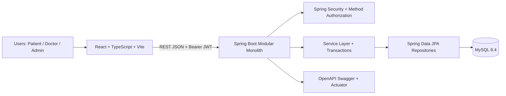
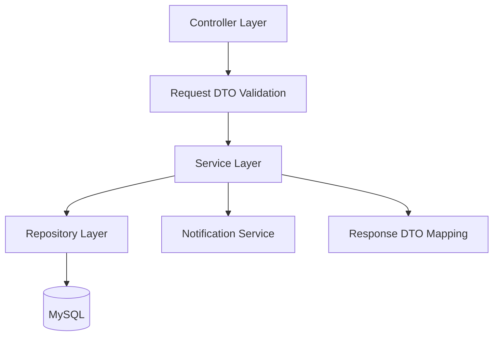
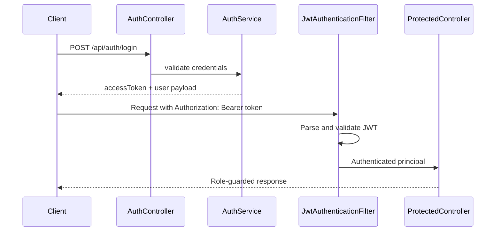

# CareConnect360 Architecture

## Overview
CareConnect360 is implemented as a modular monolith with a React frontend, Spring Boot backend, and MySQL database. The frontend communicates with backend REST APIs over HTTP using JWT Bearer authentication. Local development uses Dockerized MySQL and Vite proxying.

## Frontend
- React + TypeScript SPA with role-based routes.
- Protected route handling and role route guards.
- API client modules by domain (auth, doctor, insurance, appointment, claim, payment, notification, dashboards).
- Vite dev proxy forwards `/api` requests to backend on localhost:8080.
- Frontend API root is controlled by `VITE_API_BASE_URL` and must represent the complete API root (for example `/api` or `https://api.example.com/api`).

## Backend
- Java 17 / Spring Boot 3.5.16 modular monolith.
- Stateless JWT authentication with Spring Security filter chain.
- Role-based authorization via `@PreAuthorize`.
- Layering: controllers (HTTP), services (business rules), repositories (data access), DTOs (contract boundaries).
- OpenAPI configuration with bearerAuth security scheme.
- Flyway is the version-controlled schema owner for MySQL.
- Hibernate runs with `ddl-auto=validate` in normal runtime to verify schema consistency.

## Authentication and Authorization Flow

## Core Workflow and Transaction Boundaries
- Insurance and claim decisions enforce status transition rules.
- Appointment completion triggers claim creation in service layer.
- Payment service updates payment status and claim status (to PAID on success) in transactional flow.
- Notification records are generated for key domain events.

```mermaid
flowchart LR
  P[Patient] --> I[Submit Insurance Policy]
  I --> A1[Admin Activate Policy]
  A1 --> B[Book Appointment]
  B --> D1[Doctor Confirm]
  D1 --> D2[Doctor Complete]
  D2 --> C1[Auto Create Claim]
  C1 --> A2[Admin Verify]
  A2 --> A3[Admin Approve]
  A3 --> PM[Patient Mock Payment]
  PM --> C2[Claim Status PAID on SUCCESS]
  C2 --> N[Notification Updates]
```

## Local Runtime Topology
- Frontend: localhost:5173
- Backend: localhost:8080
- MySQL: localhost:3307 mapped to container 3306
- Swagger UI: localhost:8080/swagger-ui.html
- Health endpoint: localhost:8080/actuator/health

## Runtime Profiles and Environment Separation
- Shared baseline configuration is in `application.yml` and contains production-safe defaults only.
- Local development uses `SPRING_PROFILES_ACTIVE=local` with:
  - `APP_DOCS_ENABLED=true`
  - `APP_ADMIN_BOOTSTRAP_ENABLED=false` by default
  - `APP_CORS_ALLOWED_ORIGINS=http://localhost:5173,http://127.0.0.1:5173`
  - Actuator web exposure `health,info` and health details visible for local troubleshooting.
- Production uses `SPRING_PROFILES_ACTIVE=prod` with:
  - `APP_DOCS_ENABLED=false`
  - `APP_ADMIN_BOOTSTRAP_ENABLED=false`
  - Actuator exposure limited to `health` and health details hidden.
  - CORS restricted to exact configured origins only (no wildcard support).
- Same-origin reverse-proxy deployments can keep `APP_CORS_ALLOWED_ORIGINS` empty because browser CORS is not needed for same-origin calls.

## Frontend Deployment Models
- Local development:
  - `VITE_API_BASE_URL` unset or `/api`
  - Vite proxy routes `/api` to `http://localhost:8080`
- Same-origin production:
  - `VITE_API_BASE_URL` unset or `/api`
  - reverse proxy routes `/api` to backend
- Split-origin production:
  - `VITE_API_BASE_URL=https://api.example.com/api`
  - backend `APP_CORS_ALLOWED_ORIGINS` must include the exact frontend origin

Configuration behavior:
- `VITE_API_BASE_URL` is embedded at frontend build time, so changing it requires a frontend rebuild/redeploy.
- Do not store sensitive values in `VITE_*` variables (passwords, JWT secrets, database credentials, access tokens, private keys).

## Controlled Administrator Bootstrap
- Admin bootstrap is disabled by default in all shared/local/prod profiles and is enabled only as an explicit setup operation.
- When enabled, both `ADMIN_EMAIL` and `ADMIN_PASSWORD` must be nonblank or startup fails with a configuration error.
- After the administrator account exists, bootstrap should be turned off again.

## Migration Policy
- Applied versioned migrations are immutable.
- Future schema changes must be introduced through new migrations (`V2+`).
- Flyway clean is disabled for safety.

## Flyway Phase B (V2) Schema Hardening
- Database-level rule: at most one `ACTIVE` insurance policy per patient is enforced by generated column `insurance_policies.active_patient_id` and unique index `uk_insurance_policies_active_patient`.
- `idx_appointments_doctor_status_date_time` supports doctor schedule and availability checks, including repository patterns `findByDoctorIdAndStatusInOrderByAppointmentDateAscAppointmentTimeAsc`, `findByDoctorIdAndStatus`, and `existsByDoctorIdAndAppointmentDateAndAppointmentTimeAndStatusIn`.
- `idx_appointments_patient_status_date_time` supports patient history/upcoming views and conflict checks, including `findByPatientIdAndStatus`, `findUpcomingAppointmentsForPatient`, and `existsByPatientIdAndAppointmentDateAndAppointmentTimeAndStatusIn`.
- `idx_payments_status_created_at` supports status-based payment retrieval/reporting, including `findByStatusOrderByCreatedAtAsc` and `findByStatus`.
- Never edit applied migration files (`V1`, `V2`); all future schema changes must be introduced through `V3` or later.