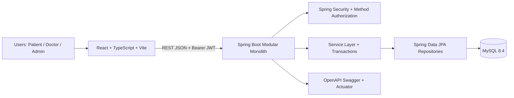
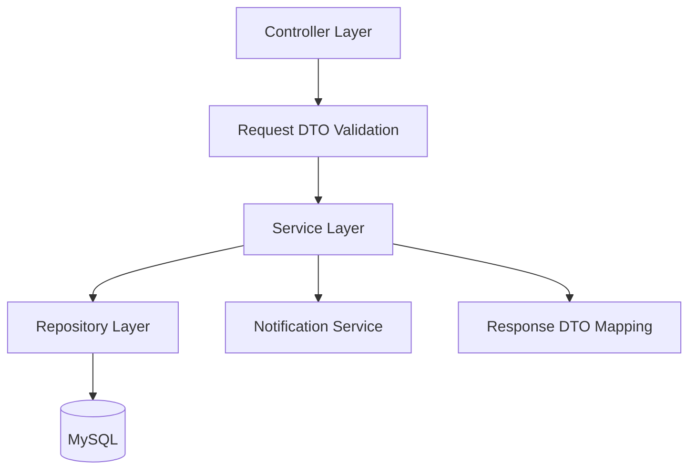
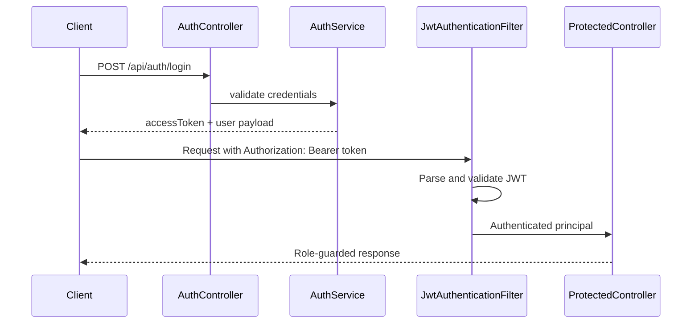

# CareConnect360 Architecture

## Overview
CareConnect360 is implemented as a modular monolith with a React frontend, Spring Boot backend, and MySQL database. The frontend communicates with backend REST APIs over HTTP using JWT Bearer authentication. Local development uses Dockerized MySQL and Vite proxying.

## Frontend
- React + TypeScript SPA with role-based routes.
- Protected route handling and role route guards.
- API client modules by domain (auth, doctor, insurance, appointment, claim, payment, notification, dashboards).
- Vite dev proxy forwards `/api` requests to backend on localhost:8080.

## Backend
- Java 17 / Spring Boot 3.5.16 modular monolith.
- Stateless JWT authentication with Spring Security filter chain.
- Role-based authorization via `@PreAuthorize`.
- Layering: controllers (HTTP), services (business rules), repositories (data access), DTOs (contract boundaries).
- OpenAPI configuration with bearerAuth security scheme.

## Authentication and Authorization Flow

## Core Workflow and Transaction Boundaries
- Insurance and claim decisions enforce status transition rules.
- Appointment completion triggers claim creation in service layer.
- Payment service updates payment status and claim status (to PAID on success) in transactional flow.
- Notification records are generated for key domain events.

```mermaid
flowchart LR
  P[Patient] --> I[Submit Insurance Policy]
  I --> A1[Admin Activate Policy]
  A1 --> B[Book Appointment]
  B --> D1[Doctor Confirm]
  D1 --> D2[Doctor Complete]
  D2 --> C1[Auto Create Claim]
  C1 --> A2[Admin Verify]
  A2 --> A3[Admin Approve]
  A3 --> PM[Patient Mock Payment]
  PM --> C2[Claim Status PAID on SUCCESS]
  C2 --> N[Notification Updates]
```

## Local Runtime Topology
- Frontend: localhost:5173
- Backend: localhost:8080
- MySQL: localhost:3307 mapped to container 3306
- Swagger UI: localhost:8080/swagger-ui.html
- Health endpoint: localhost:8080/actuator/health